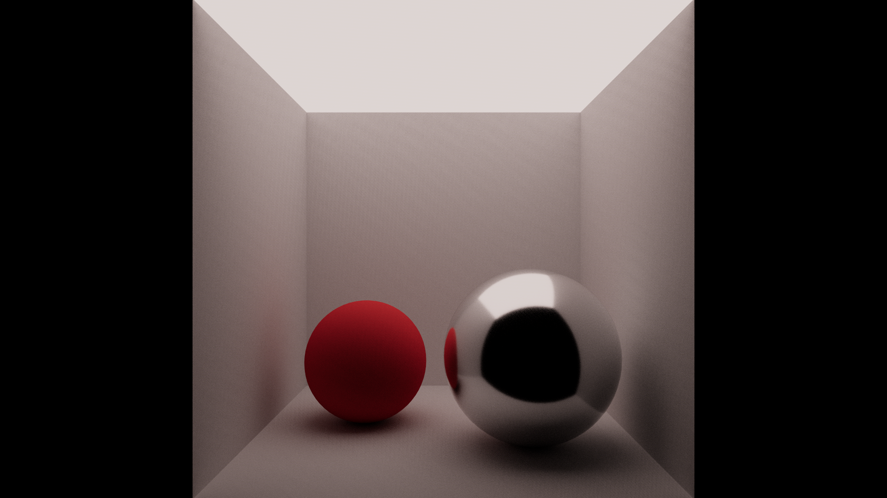
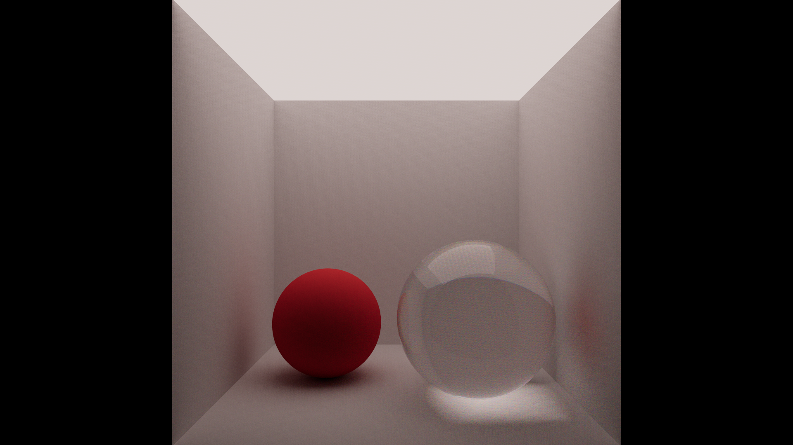
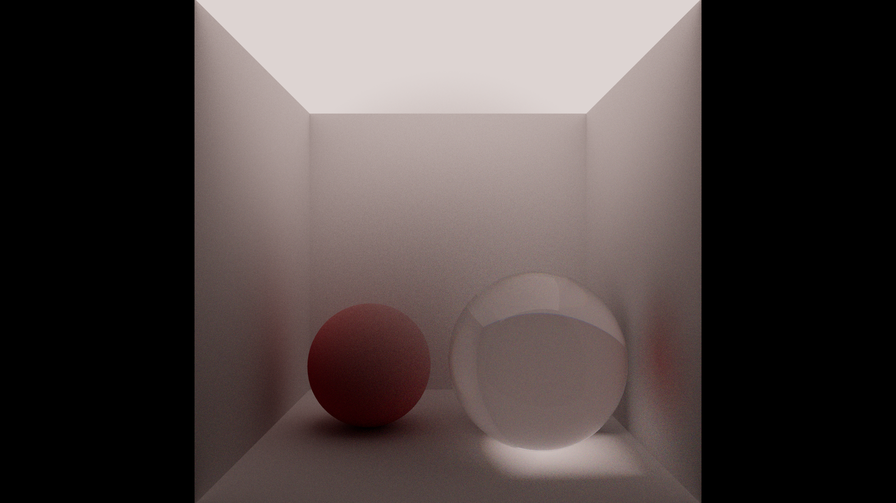

# Vera

Vera is an experimental, bleeding edge spectral path tracer. It renders light as a continuous
spectrum rather than fixed RGB triples, using Hero Wavelength Spectral Sampling (HWSS) to carry
four wavelengths per ray through the scene. This lets it handle dispersion, fluorescence style
effects, and physically accurate participating media in a way that RGB renderers cannot.

The project is CUDA based and GPU accelerated, with an optional OptiX 9.1 hardware traversal
pathway. It is built as a research vehicle for the path from HWSS through spectral ReSTIR direct
lighting and eventually a differentiable bispectral renderer.

## Gallery

A basic diffuse and metal sphere pair, rendered with the HWSS path tracer.

A rough dielectric sphere showing spectral refraction and dispersion.

A radial density fog volume rendered with heterogeneous Woodcock tracking.

## Papers

Vera's core algorithms are built directly from the following papers.

- Wilkie et al., "Hero Wavelength Spectral Sampling" (2014). The HWSS wavelength sampling and
  four lane spectral path tracing scheme.
- Walter et al., "Microfacet Models for Refraction through Rough Surfaces" (2007). The rough
  dielectric BTDF and VNDF based transmission sampling.
- Heitz, "Sampling the GGX Distribution of Visible Normals" (2018). GGX visible normal sampling
  for both reflection and transmission.
- Novák et al., "Residual Ratio Tracking for Estimating Attenuation in Participating Media"
  (2014). Ratio tracking used for shadow ray transmittance through media.
- Kutz, Habel, Li and Novák, "Spectral and Decomposition Tracking for Rendering Heterogeneous
  Volumes" (2017). Spectral Woodcock tracking for heterogeneous, spatially varying media.
- Jakob and Hanika, "A Low-Dimensional Function Space for Efficient Spectral Upsampling"
  (2019). Converts artist authored RGB colors into smooth sigmoid polynomial reflectance spectra.
- Wyman, Sloan and Shirley, "Simple Analytic Approximations to the CIE XYZ Color Matching
  Functions" (2013). The analytic Gaussian fit used to convert sampled wavelengths back to CIE
  XYZ for the framebuffer.
- Kollig and Keller, "Efficient Multidimensional Sampling" (2002). Random digit scrambling
  applied to the Halton sequence used for quasi Monte Carlo sampling.
- Veach, "Robust Monte Carlo Methods for Light Transport Simulation" (1997). The power heuristic
  used to combine next event estimation and BSDF sampling.
- Schlick, "An Inexpensive BRDF Model for Physically-based Rendering" (1994). The Fresnel
  approximation used for GGX conductors and dielectric reflectance blending.
